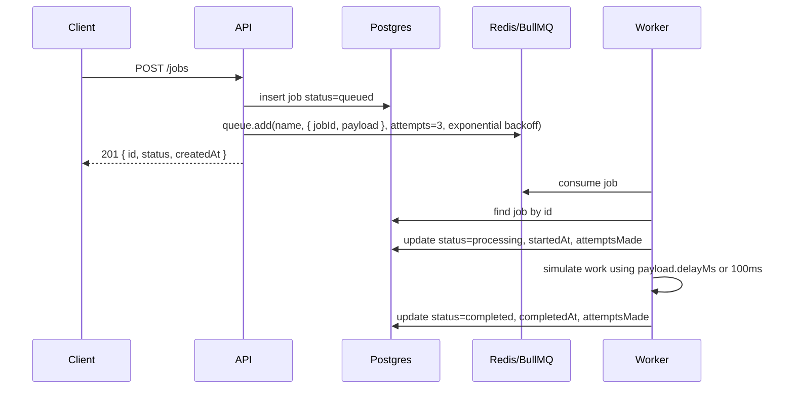
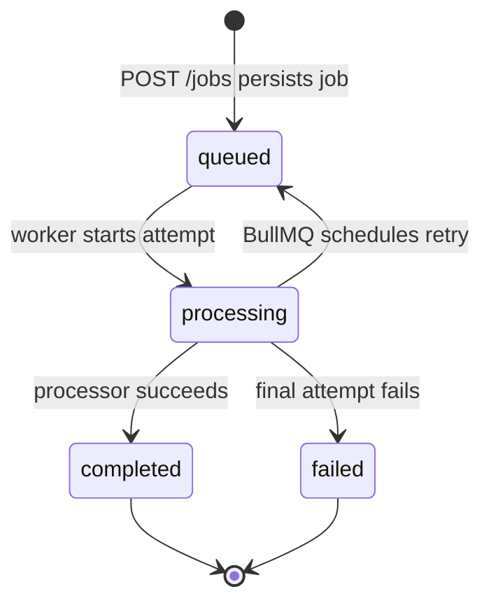

# Queue Flow

TaskQueueMini uses the API as the producer, BullMQ and Redis as the queue
runtime, Postgres as the durable source of truth, and the worker as the
consumer that advances job state.

## Components

| Component | Responsibility                                                                          |
| --------- | --------------------------------------------------------------------------------------- |
| API       | Accepts HTTP requests, persists job records, enqueues work, and exposes read endpoints. |
| Postgres  | Stores durable job state in the `jobs` table.                                           |
| Redis     | Stores BullMQ queue data and retry/backoff state.                                       |
| Worker    | Pulls BullMQ jobs, updates lifecycle state in Postgres, and marks terminal outcomes.    |

## Enqueue To Completion



If `queue.add` fails after the database insert, the API deletes the created
job row and returns `503 ENQUEUE_FAILED`. This keeps the database from
holding a queued job that Redis never received.

## State Machine



Terminal jobs are idempotent in the worker. If a BullMQ job points at a
database job that is already `completed` or `failed`, the worker logs and
skips it instead of rewriting terminal state.

## Retry And Failure

The API enqueues each job with `attempts: 3` and exponential backoff starting
at `1000ms`.

On non-final failures, the worker keeps the database row non-terminal and
updates `attemptsMade` for observability. On the final failed attempt, the
worker persists:

- `status: failed`
- `errorMessage: err.message`
- `attemptsMade: job.attemptsMade`

BullMQ owns retry scheduling in Redis. Postgres owns the durable job status
that API clients read.

## HTTP Endpoints

| Method | Path                          | Purpose                                                | Success Response                                |
| ------ | ----------------------------- | ------------------------------------------------------ | ----------------------------------------------- |
| `GET`  | `/health`                     | API health check.                                      | `200 { "ok": true }`                            |
| `POST` | `/jobs`                       | Create a database job and enqueue it in BullMQ.        | `201 { "id", "status", "createdAt" }`           |
| `GET`  | `/jobs/:id`                   | Fetch a single job by id.                              | `200 JobRecord`                                 |
| `GET`  | `/jobs/failed?limit=&cursor=` | List failed jobs ordered by `createdAt desc, id desc`. | `200 { "items", "nextCursor" }`                 |
| `GET`  | `/metrics`                    | Expose database status counts and BullMQ queue counts. | `200 { "jobsByStatus", "redisQueueJobCounts" }` |

## Error Shape

HTTP errors use a stable JSON envelope:

```json
{
  "error": {
    "code": "ERROR_CODE",
    "message": "Human readable message"
  }
}
```

Known endpoint-level errors include:

| Condition                         | Status | Code               |
| --------------------------------- | ------ | ------------------ |
| Invalid JSON body                 | `400`  | `INVALID_JSON`     |
| Invalid request payload or job id | `400`  | `VALIDATION_ERROR` |
| Invalid failed-jobs cursor        | `400`  | `INVALID_CURSOR`   |
| Job not found                     | `404`  | `JOB_NOT_FOUND`    |
| Queue enqueue failure             | `503`  | `ENQUEUE_FAILED`   |
| Unknown route                     | `404`  | `NOT_FOUND`        |

## Metrics Snapshot

`GET /metrics` combines two views:

- `jobsByStatus`: Postgres counts grouped by `queued`, `processing`,
  `completed`, and `failed`.
- `redisQueueJobCounts`: BullMQ counts for `wait`, `active`, `completed`,
  `failed`, `delayed`, and `paused`.

The database view is the durable business state. The Redis view is the queue
runtime state.
